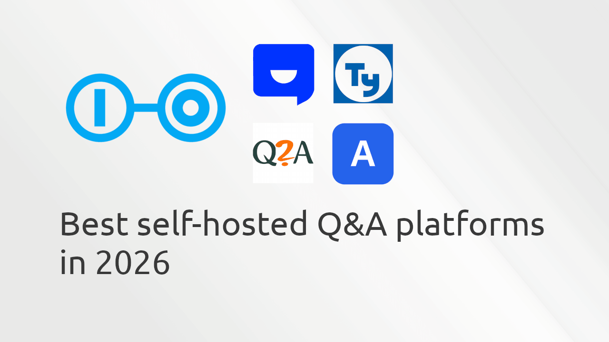

If your team is drowning in Slack messages, duplicate support tickets, or scattered documentation,
a self-hosted Q&A platform may be the solution your team needs.

Unlike traditional forums or wikis, Q&A platforms are designed to surface the best answer quickly through
voting, accepted answers, reputation systems, and powerful search. They're ideal for internal knowledge bases,
developer communities, customer support portals, and product documentation.

<!-- more -->

In this guide, we'll compare five of the best self-hosted Q&A platforms available in 2026 (in no particular order):

- Apache Answer
- Askbot
- Scoold Pro
- Question2Answer (Q2A)
- Talkyard

All of these can be self-hosted, but they differ significantly in technology stack, licensing, extensibility, and enterprise features.

| Platform        | Best for                                     | License                 | Enterprise Ready |
| --------------- | -------------------------------------------- | ----------------------- | ---------------- |
| Apache Answer   | Public communities                           | Apache 2.0              | ⭐⭐⭐⭐         |
| Askbot          | Mature Python deployments                    | GPLv3                   | ⭐⭐⭐           |
| Scoold Pro      | Internal knowledge hubs & developer portals  | Apache 2.0 / Commercial | ⭐⭐⭐⭐⭐       |
| Question2Answer | Smaller forums deployed on shared hosting    | GPLv3                   | ⭐⭐⭐           |
| Talkyard        | Community discussions with threaded comments | AGPLv3                  | ⭐⭐⭐⭐         |

## Apache Answer

Apache Answer has become one of the fastest-growing open-source Q&A platforms in recent years. Developed under the Apache Software Foundation, it emphasizes performance, extensibility, and container-friendly deployments.

Its architecture is modern, the user interface is clean, and it includes a plugin system, REST APIs, and strong moderation tools. Compared to older projects like Askbot or Q2A, Apache Answer feels much more contemporary.

**Pros**: Apache License 2.0, modern architecture, plugin ecosystem, excellent Docker support. 
**Cons**: Fewer enterprise integrations than Scoold, smaller ecosystem than older projects. 
**Best for:** Public knowledge communities and organizations that want a lightweight, modern Q&A platform.

## Askbot

Askbot is one of the oldest surviving Stack Overflow clones. Built with Django, it has been around for over a decade and remains a solid choice for organizations already invested in Python.

Although the project is mature, development has slowed considerably compared to newer alternatives, and its user interface shows its age.

**Pros**: Mature project, Django ecosystem, commercial support available. 
**Cons**: GPLv3 license, older UI, smaller development activity. 
**Best for:** Organizations already running Python infrastructure.

## Scoold Pro

Scoold Pro is a modern alternative to Stack Overflow Business knowledge sharing platform built for companies that need an internal Q&A system, developer portal, or customer support community.

Unlike many older Q&A projects, Scoold is actively maintained and focuses on simplicity, fast deployment, and enterprise integrations. It runs on Java and Spring Boot, supports virtually any database, and can be deployed with Docker, Kubernetes, or directly on the JVM. It also offers an officially hosted cloud version for organizations that prefer a managed service.

**Pros:** Modern UI, private spaces, advanced SSO (LDAP, SAML, OAuth2), REST API, webhooks, MCP Server, enterprise support. 
**Cons:** Slightly more complex deployment with Java and the Para backend server. 
**Best for:** Companies looking for a Stack Overflow Business alternative that is easy to deploy and customize. Managed cloud hosting is also an option.

## Question2Answer (Q2A)

Question2Answer (Q2A) remains one of the easiest Q&A platforms to deploy. If you already have a standard PHP hosting environment, you can have it running within minutes.

Its plugin ecosystem is extensive, although many features that are built into modern platforms require plugins. The interface also feels somewhat dated by today's standards.

**Pros**: Very easy installation, large plugin ecosystem, huge community. 
**Cons**: Older interface, GPLv3, limited enterprise capabilities. 
**Best for:** Small communities and hobby projects.

## Talkyard

Talkyard combines traditional discussion forums with Stack Overflow-style Q&A. Instead of focusing exclusively on questions and answers, it also supports threaded discussions, idea voting, comments, and embedded conversations.

If you're looking for something between Discourse and Stack Overflow, Talkyard offers an interesting hybrid approach.

**Pros**: Modern UI, threaded discussions, blog comment embedding, active development. 
**Cons**: More discussion-oriented than pure Q&A, AGPL license. 
**Best for:** Communities that need both forums and Q&A.

## Which platform should you choose?

Each platform serves a different audience.

Choose Scoold Pro if you need an enterprise-ready knowledge base, internal Q&A platform, or Stack Overflow Business alternative with commercial support.
Choose Apache Answer if you want a modern, Apache-licensed Q&A platform for public communities.
Choose Askbot if your infrastructure is already built around Django.
Choose Question2Answer if you need the simplest PHP deployment.
Choose Talkyard if your community relies heavily on threaded comments in discussions.

## Final thoughts

Open-source Q&A software has matured considerably over the past few years. While older projects like Askbot and Q2A are still widely used, newer platforms such as Apache Answer and Scoold bring modern deployment models, better APIs, cloud-native architectures, and stronger enterprise capabilities.

If your primary goal is building an internal knowledge base or developer hub, investing in a platform that combines ease of deployment with long-term maintainability will pay dividends as your organization's knowledge grows.
