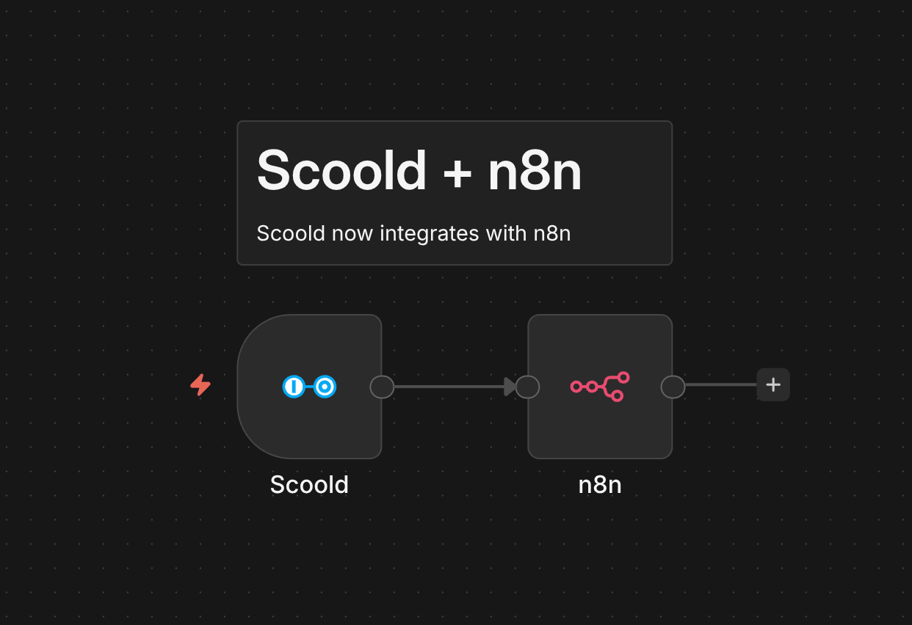
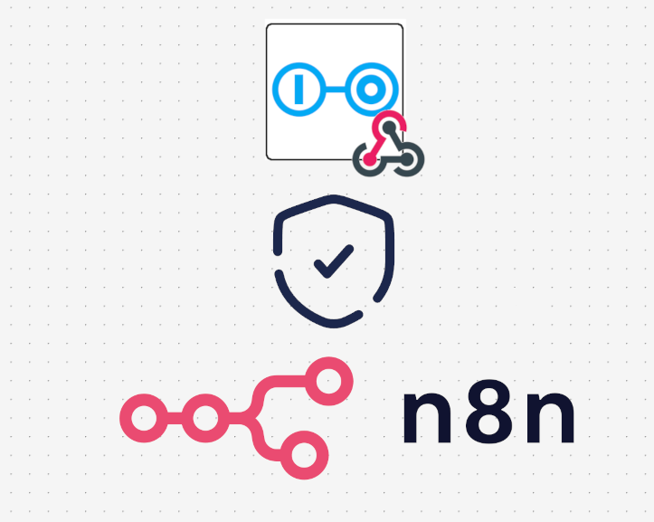
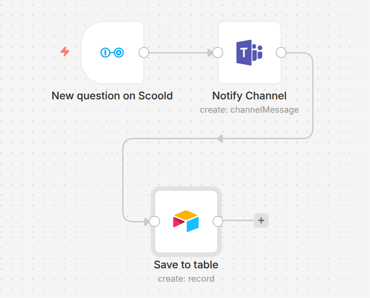
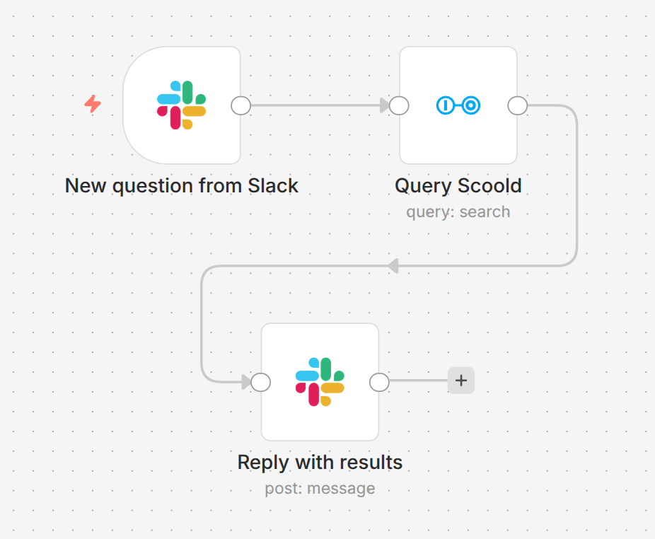

**I'm excited to announce the official Scoold community node for n8n!** You can now connect
Scoold to hundreds of apps and services - Slack, Jira, GitHub, Google Sheets, email, you name it - and automate
your knowledge-base workflows without writing a single line of code.

<!-- more -->



[n8n](https://n8n.io) is an open-source workflow automation platform similar in spirit to Zapier
but more flexible: you can self-host it and you can build arbitrarily complex workflows using its visual
editor. Scoold joins a library of hundreds of integrations available in n8n. The package is published on npm as
`@erudika/n8n-nodes-scoold` and provides two nodes:

- **Scoold** - lets you create, read, update, and delete posts, comments, tags, and reports, or search content
- **Scoold Trigger** - starts a workflow the moment a Scoold event fires

## Installation

Installing community nodes in n8n takes about 30 seconds. Go to **n8n Settings → Community Nodes**,
click **Install**, and enter the package name `@erudika/n8n-nodes-scoold`.
If you're self-hosting n8n via npm you can also install it directly:

```bash
npm i @erudika/n8n-nodes-scoold
```

Once installed, search for "Scoold" in the node picker and both nodes will appear.

## Credentials & Security

Before you can use either node you need a Scoold API key. Head to the **Administration** page in your Scoold
instance, scroll to the **API** section, and generate a new JWT key. Then create a **Scoold API** credential in n8n
and paste in your instance URL and the key. n8n will automatically verify the credential by calling `/api/stats`.



The Scoold node for n8n also verifies every request coming from Scoold to n8n. Each webhook payload is signed
and if the signature does not match on the n8n side, then the request is discarded. This prevents man-in-the-middle
attacks and guarantees the integrity of every request.

## Trigger node

The trigger node is the starting point for all event-driven workflows. When you activate a workflow, the node
registers a webhook in Scoold automatically - there's no manual setup and nothing to configure on the server
beyond enabling webhooks in your configuration:

```ini
scoold.webhooks_enabled = true
```

You subscribe to one or more named events loaded directly from your Scoold instance, for example
`question.create`, `answer.create`, `comment.create`, `report.create`, or `user.signup`. You can also subscribe
to low-level CRUD events from Para such as `update` and `delete` and narrow them down with a **Property Filter**,
for example `type:question` or `space:engineering`.



Every item emitted by the trigger carries a `_scoold` metadata field with the event name, timestamp, app ID and
webhook ID so downstream nodes always know the full context of what just happened. The webhook is automatically
removed from Scoold when you deactivate the workflow.

## Action node

The action node gives you direct API access to your Scoold community. Pick a **Resource** and an **Operation**
and the node handles authentication, serialization and pagination for you.

You can create questions, answers, and sticky posts, update or delete existing ones, and fetch a post's answers,
comments, or full revision history. Creating an answer is as simple as setting **Post Type** to `reply` and
pointing **Parent Post ID** at the question. Markdown is supported in the body, and you can assign the post to
any space or override the author with a `creatorid` for bulk imports.

All three resources follow the same pattern: create, get, update (where applicable), delete, and list. For
reports there is also a **Close** operation that lets you resolve a report and record the actions taken. This is
particularly useful for moderation workflows - for example, automatically closing reports whose linked post has
already been deleted, or routing `SPAM` reports to a Slack channel for manual review.

### Search

The Search resource lets you run full-text queries across any content type - questions, answers, users, tags,
comments, and more. Enable **Return All** to automatically paginate through every result using cursor-based
pagination, or page through results manually with **Limit** and **Page**.

## Workflow ideas

Here are a few practical workflows you can build today:

- **Unanswered question reminder** - trigger on `question.create`, wait 48 hours with a Wait node, check if
  `answercount` is still 0, and post a reminder in Slack.
- **Spam moderation** - trigger on `report.create`, filter for `subType:SPAM`, delete the reported post with the
  Scoold node, then close the report automatically.
- **Knowledge base mirror** - trigger on `question.create` or `answer.create` and append new content to a Google
  Sheet or Notion database for offline review.
- **New member welcome** - trigger on `user.signup` and send a personalised welcome email via SendGrid or Gmail.
- **Weekly digest** - use a Schedule Trigger, query the Search resource for the top-voted questions from the past
  seven days, and email a digest to your team.



Full documentation is available on the [Scoold n8n integration page](https://scoold.com/documentation/integrations/n8n/).
The source code for the node is open on [GitHub](https://github.com/Erudika/n8n-nodes-scoold) - issues and pull
requests are always welcome.

*Hey, I'm Alexander - an [indie solo developer](https://www.indiehackers.com/albogdano) working on
[Scoold](https://scoold.com) and [Scoold Cloud](https://cloud.scoold.com) in the open. Questions? Ask me anything
about Scoold [on Gitter](https://gitter.im/Erudika/scoold)!*
